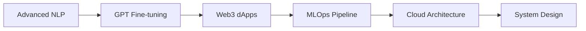

# 🚀 Hey there, I'm Adivigneshwaran
## Code Architect | Full-Stack Innovator | AI Enthusiast

<div align="center">
  
</div>


### 🧠 About Me
- 🎯 **Mission**: Architecting scalable solutions that bridge **Frontend Magic** + **Backend Power** + **AI Intelligence**
- 🌱 **Currently Mastering**: Advanced AI/ML algorithms, NLP models, and Web3 integrations
- 🎮 **When not coding**: Gaming sessions and planning my epic Japan adventure 🇯🇵
- 🏛️ **Education**: Computer Science @ **SRM Ramapuram** | CGPA: **9.05** ⭐
- ⚡ **Philosophy**: *"Code is poetry, and every bug is just a plot twist"*

<br clear="right"/>

---

## 🏆 Achievement Showcase

<div align="center">
  
| 🥈 **2nd Prize** | 🎓 **Academic Excellence** | 🧑‍🏫 **Mentorship** | 💡 **Community Impact** |
|:---:|:---:|:---:|:---:|
| Season of Solution | CGPA: 9.05 (Sem 2) | UI/UX Bootcamp Mentor | DSC Club Frontend Teacher |
| *UI/UX + Dev Contest* | *8.7 (Sem 1)* | *3-day intensive program* | *Empowering next-gen developers* |

</div>

---

## 🛠️ Project Arsenal

<table>
<tr>
<td width="50%">

### 🔍 **Fake Product Identifier**
*AI + Web3 Revolution*
```
🤖 AI-powered counterfeit detection
🔗 Blockchain-secured data storage  
📱 Barcode scanning integration
🛡️ Trust & authenticity guarantee
```

### 💼 **Resume Reviewer**
*Career Intelligence Platform*
```
📊 AI-based resume scoring
🎯 Personalized job recommendations
🤖 Interactive chatbot guidance
📈 Career growth insights
```

### 🏥 **MediOrder**
*Healthcare E-commerce*
```
💊 Full-stack medication platform
🗄️ Advanced DBMS architecture
🔄 Real-time order tracking
👨‍⚕️ Prescription management
```

</td>
<td width="50%">

### 🏠 **Home Renovation System**
*Smart Construction Planner*
```
📐 Budget-based planning tool
🛒 Material procurement system
📋 Project timeline management
💰 Cost optimization engine
```

### 🛡️ **Credit Card Fraud Detection**
*ML Security Guardian*
```
🧠 Advanced ML algorithms
⚡ Real-time fraud detection
🎨 Intuitive dashboard design
🔒 Financial security enhancement
```

### 🎮 **Gaming Corner**
*Personal Passion Projects*
```
🕹️ Indie game experiments
🎯 Interactive web experiences
🎨 Creative coding challenges
🚀 Fun side projects
```

</td>
</tr>
</table>

---

## 💻 Tech Stack Universe

<div align="center">

### **Frontend Mastery**


### **Backend Architecture**


### **AI/ML & Data Science**


### **Design & Development Tools**


</div>

---

## 📊 GitHub Analytics

<div align="center">
  


</div>

<div align="center">
  
[](https://git.io/streak-stats)

</div>

<div align="center">
  
[](https://github.com/ashutosh00710/github-readme-activity-graph)

</div>

---

## 🎯 Current Learning Path

<div align="center">



</div>

---

## 🌟 Let's Connect & Collaborate

<div align="center">

[](https://www.linkedin.com/in/adivigneshwaran)
[](https://adivigneshwaran.vercel.app)
[](https://www.instagram.com/adivigneshwaran)
[](mailto:adivigneshwaran@gmail.com)

</div>

---

## 💡 Fun Facts & Interests

<div align="center">
  
🎮 **Gaming Enthusiast** | 🍜 **Anime Culture Explorer** | 🇯🇵 **Future Japan Traveler**
  
🎯 **2024 Goals**: Master GraphQL • Build SaaS Product • Contribute to Open Source • Visit Tokyo
  
</div>

---

<div align="center">
  
### 🔥 *"Architecture is not just about building systems, it's about crafting experiences that matter"*


**⭐ If my work resonates with you, don't forget to star some repositories!**

</div>

---

<div align="center">
  


</div>
