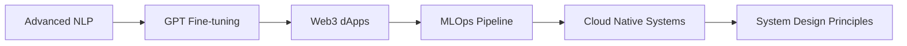

# 🚀 Hey there, I'm Adivigneshwaran
## Code Architect | Full-Stack Innovator | AI Enthusiast

<div align="center">
  
</div>


### 🧠 About Me
- 🎯 **Mission**: Designing seamless ecosystems powered by **Frontend Magic**, **Backend Brains**, and **AI Ingenuity**
- 🌱 **Mastering**: NLP, AI/ML Pipelines, and Web3 dApps
- 🎮 **Beyond Code**: Competitive gaming, anime, and future travels to Japan 🇯🇵
- 🏛️ **Proudly @ SRM Ramapuram** – CGPA **9.05**
- ⚡ **Philosophy**: *"Every line of code is a line of story"*

---

## 🏆 Achievements

<div align="center">

| 🥈 **2nd Prize** | 🎓 **Academic Star** | 🧑‍🏫 **Mentor Role** | 💡 **Community Builder** |
|:---------------:|:-------------------:|:------------------:|:------------------------:|
| Season of Solution | CGPA: 9.05 (Sem 2) | UI/UX Bootcamp (3 Days) | Frontend Mentor - DSC |

</div>

---

## 🚧 Projects Worth Noting

<table>
<tr>
<td width="50%">

### 🔍 Fake Product Identifier
```
🤖 AI for fake product detection
🔗 Secured with Web3
📲 Barcode scanner powered UI
🛡️ Fighting counterfeits at scale
```

### 💼 Resume Reviewer
```
📊 Resume scoring with AI
🔍 Job mapping engine
🤖 Chatbot support
🎓 Tailored career paths
```

### 🏥 MediOrder
```
💊 Medicine ordering system
📦 Inventory + order tracking
📄 Prescription uploads
🔧 Built with Django, DBMS
```

</td>
<td width="50%">

### 🏠 Home Renovation Planner
```
📐 Budget-based project planning
🛒 Smart procurement guide
🗂️ Timeline & cost tracking
👷 Built with React + Firebase
```

### 🛡️ Fraud Detection System
```
🧠 Trained ML models
⚡ Real-time credit fraud alerts
📊 Admin dashboards
🔐 Fintech-ready APIs
```

### 🎮 Game Dev Projects
```
🎯 Indie HTML5 games
🧠 Logic puzzles in JS
🎨 Visual storytelling
🚀 Hosted on GitHub Pages
```

</td>
</tr>
</table>

---

## 🧰 Tech Arsenal

<div align="center">

### 💻 Frontend


### 🔙 Backend


### 🧠 AI/ML + Data


### 🎨 Design & Tools


</div>

---

## 📈 GitHub Insights

<div align="center">


[](https://github.com/Adivigneshwar)

</div>

---

## 🚀 Learning Journey

<div align="center">



</div>

---

## 🤝 Let's Connect

<div align="center">

[](https://www.linkedin.com/in/adivigneshwaran)
[](https://adivigneshwaran.vercel.app)
[](https://www.instagram.com/adivigneshwaran)
[](mailto:adivigneshwaran@gmail.com)

</div>

---

## 🎯 Interests & Goals

<div align="center">

🎮 Gaming | 🍥 Anime | ✈️ Japan-bound Explorer  
📌 **2024 Goals**: SaaS product launch • GraphQL mastery • Open Source streak • Tokyo meetup

</div>

---

<div align="center">

> 🔥 "Architecture isn't just about code; it's about creating digital stories people want to use."


⭐ *If something here inspires you, show some ❤️ by starring a repo!*


</div>
